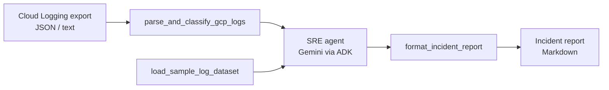

# 🚨 SRE Agent


An AI Site Reliability Engineer that reads **GCP Cloud Logging** exports, classifies every event by severity, traces cascading failures across services, and writes a structured **incident report** with a root cause analysis and prioritized remediation steps.

More like a conceptual AI SRE assistant rather than a production-ready tool. Built with the [Agent Development Kit (ADK)](https://adk.dev/) and Gemini, scaffolded with [`agents-cli`](https://pypi.org/project/google-agents-cli/) 1.9.0, and deployable to **Vertex AI Agent Runtime** behind an **Agent Gateway**.

## Contents

- [Why it's useful](#why-its-useful)
- [How it works](#how-it-works)
- [Getting started](#getting-started)
- [Usage](#usage)
- [Deploying to Google Cloud](#deploying-to-google-cloud)
- [Project layout](#project-layout)
- [Development](#development)
- [Getting help](#getting-help)
- [Maintainers and contributing](#maintainers-and-contributing)

## Why it's useful

During an outage, the answer is usually somewhere in thousands of log lines across several services. This agent does the first pass for you:

- **Severity classification**: sorts each event into `CRITICAL`, `WARNING` or `INFO` using native GCP severity plus keyword and HTTP status signals (for example `OOMKilled`, `too many connections`, `503`, `429`).
- **Cascading failure detection**: correlates timestamps, resource labels and trace IDs across Cloud Run, Cloud SQL, GKE and Pub/Sub, such as a database connection pool exhaustion that surfaces as frontend `503`s.
- **A ready-to-share report**: overall severity, executive summary, severity breakdown, timeline, root cause analysis with log evidence, and P0/P1 action items. See [`incident_report.md`](incident_report.md) for a real output.
- **Works offline-first**: a deterministic parser classifies logs even if the model is unreachable, and the CLI falls back to a diagnostic report.
- **Production-ready deployment**: A2A protocol endpoints, Cloud Trace / BigQuery / Cloud Logging telemetry, Terraform infrastructure, and GitHub Actions with keyless authentication (Workload Identity Federation).

## How it works



The agent (`app/agent.py`) exposes three tools from [`app/sre_tools.py`](app/sre_tools.py); the parsing and classification rules live in [`app/log_parser.py`](app/log_parser.py).

## Getting started

### Prerequisites

| Tool | Purpose | Install |
| --- | --- | --- |
| [uv](https://docs.astral.sh/uv/getting-started/installation/) | Python and dependency management | `pip install uv` or the official installer |
| [agents-cli](https://pypi.org/project/google-agents-cli/) | Run, evaluate and deploy the agent | `uv tool install google-agents-cli` |
| [Google Cloud SDK](https://cloud.google.com/sdk/docs/install) | Authentication and GCP access | see link |
| [Terraform](https://developer.hashicorp.com/terraform/downloads) ≥ 1.11 | Infrastructure (deployment only) | see link |

You also need a Google Cloud project with Vertex AI enabled.

### Install and configure

```bash
git clone https://github.com/paudan/sre-agent.git
cd sre-agent

gcloud auth application-default login
cp .env.example .env          # then set GOOGLE_CLOUD_PROJECT
agents-cli install
```

`.env` selects how the model is reached:

```dotenv
GOOGLE_GENAI_USE_ENTERPRISE=true
GOOGLE_CLOUD_PROJECT=your-gcp-project-id
GOOGLE_CLOUD_LOCATION=global
# Or use a Gemini API key instead of Vertex AI:
# GEMINI_API_KEY=your-api-key-here
```

The model defaults to `gemini-2.5-flash`; override it with the `GEMINI_MODEL` environment variable.

## Usage

### Analyze logs from the command line

```bash
# Bundled outage scenario (Cloud SQL exhaustion -> 503s, OOMKilled pod, Pub/Sub 429s)
uv run python run_sre_agent.py --sample

# Your own Cloud Logging export, saved as a Markdown report
uv run python run_sre_agent.py --log-file path/to/logs.json --output report.md
```

Export logs with `gcloud logging read '<filter>' --format=json > logs.json`.

### Chat with the agent

```bash
agents-cli playground
```

Then ask, for example: *"Analyze the sample logs and give me the incident report."* The playground reloads on save.

### Call a deployed agent

```bash
agents-cli run --url <deployed-agent-url> --mode a2a "Analyze the sample logs"
```

The agent also supports the [A2A protocol](https://a2a-protocol.org/); test interoperability with the [A2A Inspector](https://github.com/a2aproject/a2a-inspector).

## Deploying to Google Cloud

The default setup is **one environment** on **Agent Runtime** with Terraform in [`deployment/terraform/single-project`](deployment/terraform/single-project) and GitHub Actions in [`.github/workflows`](.github/workflows).

### 1. Provision infrastructure

Create `deployment/terraform/single-project/terraform.tfvars` (git-ignored):

```hcl
project_name     = "sre-agent"
project_id       = "<your-project-id>"
region           = "us-east1"
repository_owner = "<your-github-user>"
repository_name  = "sre-agent"
```

Point [`backend.tf`](deployment/terraform/single-project/backend.tf) at your own Terraform state bucket, then:

```bash
cd deployment/terraform/single-project
terraform init
terraform apply
```

This creates the Agent Runtime engine (running as an **Agent Identity**), logging and BigQuery telemetry, the Workload Identity pool for GitHub, and the **Agent Gateway** with its Agent Registry allow-list.

> **Note:** If a resource already exists (`Error 409`), import it with `terraform import` instead of retrying.

### 2. Configure GitHub

```bash
# requires an authenticated `gh` and `gcloud`; reads values from .env
./scripts/init_github_secrets.sh        # or scripts\init_github_secrets.ps1 on Windows
```

This stores the project settings as GitHub **secrets** (the only exception is the non-sensitive variable `GOOGLE_GENAI_USE_ENTERPRISE`), so nothing about your project is visible in a public repository.

### 3. Deploy

Push to `main`, or run the **Deploy to GCP** workflow manually. It authenticates with Workload Identity Federation, looks up the Agent Gateway, and calls the reusable action in [`.github/actions/deploy-agent`](.github/actions/deploy-agent/action.yml), which deploys with `agents-cli`, binds the gateway and runs a load test.

To deploy by hand instead:

```bash
agents-cli deploy --project <your-project-id> --region us-east1
```

Pull requests run [`pr_checks.yaml`](.github/workflows/pr_checks.yaml): lint, unit tests and integration tests.

## Project layout

```
sre-agent/
├── app/
│   ├── agent.py                  # Agent definition, instruction and tools wiring
│   ├── sre_tools.py              # Tools exposed to the model
│   ├── log_parser.py             # Log parsing and severity classification
│   ├── fast_api_app.py           # FastAPI server (ADK API + A2A routes)
│   └── app_utils/                # A2A, session and Agent Runtime adapters
├── run_sre_agent.py              # Command-line runner
├── sample_logs/                  # Example Cloud Logging outage export
├── tests/                        # unit, integration, eval and load tests
├── deployment/terraform/         # single-project infrastructure
├── scripts/                      # GitHub secrets bootstrap (bash and PowerShell)
├── .github/                      # workflows and the reusable deploy action
├── agents-cli-manifest.yaml      # agents-cli project settings
└── GEMINI.md                     # guide for AI coding assistants
```

## Development

| Task | Command |
| --- | --- |
| Install dependencies | `agents-cli install` |
| Run locally | `agents-cli playground` |
| Lint | `agents-cli lint` |
| Unit and integration tests | `uv run pytest tests/unit tests/integration` |
| Evaluate agent quality | `agents-cli eval run` (datasets in [`tests/eval`](tests/eval)) |
| Load test a deployed agent | see [`tests/load_test/README.md`](tests/load_test/README.md) |
| Upgrade scaffolding | `agents-cli scaffold upgrade` |

Behavior is changed in `app/agent.py` (instruction, model, tools) and `app/log_parser.py` (classification rules). Prefer eval cases over asserting on model text in unit tests.

## Getting help

- 🐞 **Bugs and questions**: [open an issue](../../issues).
- 📚 **ADK**: [adk.dev](https://adk.dev/)
- 🧰 **agents-cli**: [PyPI project](https://pypi.org/project/google-agents-cli/), or `agents-cli --help`
- 🤖 **Agent Runtime and Agent Gateway**: [Gemini Enterprise Agent Platform docs](https://docs.cloud.google.com/gemini-enterprise-agent-platform)
- 🔌 **A2A protocol**: [a2a-protocol.org](https://a2a-protocol.org/)

## Maintainers

Maintained by [Paulius Danėnas](https://github.com/paudan).
